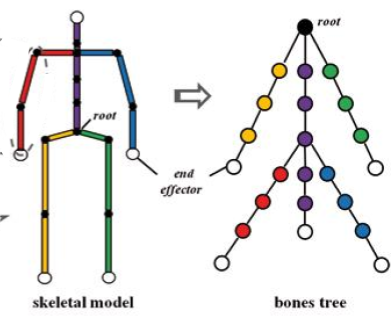
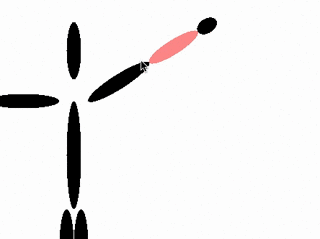
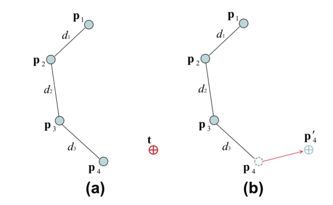
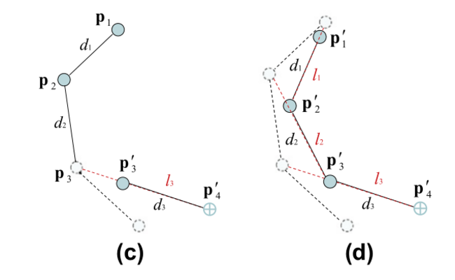
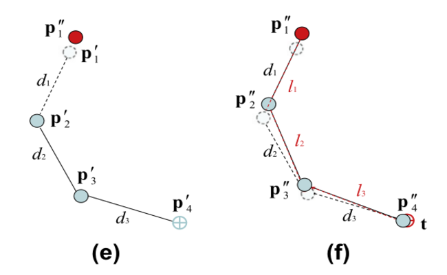
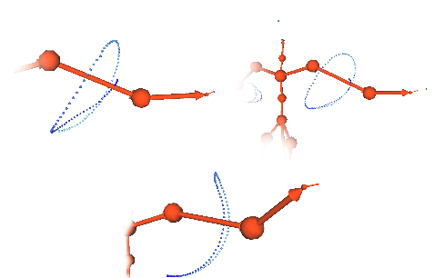
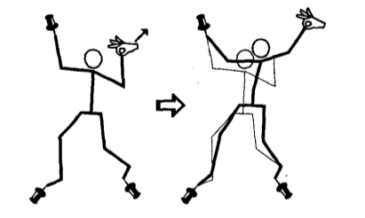

<section id="themes">
	<h2>Themes</h2>
		

			Set your presentation theme:  
			<!-- Hacks to swap themes after the page has loaded. Not flexible and only intended for the reveal.js demo deck. -->
                        <a href="#" onclick="document.getElementById('theme').setAttribute('href','css/theme/black.css'); return false;">Black (default)</a> -
			<a href="#" onclick="document.getElementById('theme').setAttribute('href','css/theme/white.css'); return false;">White</a> -
			<a href="#" onclick="document.getElementById('theme').setAttribute('href','css/theme/league.css'); return false;">League</a> -
			<a href="#" onclick="document.getElementById('theme').setAttribute('href','css/theme/sky.css'); return false;">Sky</a> -
			<a href="#" onclick="document.getElementById('theme').setAttribute('href','css/theme/beige.css'); return false;">Beige</a> -
			<a href="#" onclick="document.getElementById('theme').setAttribute('href','css/theme/simple.css'); return false;">Simple</a>  
			<a href="#" onclick="document.getElementById('theme').setAttribute('href','css/theme/serif.css'); return false;">Serif</a> -
			<a href="#" onclick="document.getElementById('theme').setAttribute('href','css/theme/blood.css'); return false;">Blood</a> -
			<a href="#" onclick="document.getElementById('theme').setAttribute('href','css/theme/night.css'); return false;">Night</a> -
			<a href="#" onclick="document.getElementById('theme').setAttribute('href','css/theme/moon.css'); return false;">Moon</a> -
			<a href="#" onclick="document.getElementById('theme').setAttribute('href','css/theme/solarized.css'); return false;">Solarized</a>
		

</section>

H:

# Forward and Inverse Kinematics on Frames

Sebastian Eduardo Chaparro Cuevas

H:

# Index

 1. Skeletal Animation<!-- .element: class="fragment" data-fragment-index="1"-->
 2. Forward Kinematics<!-- .element: class="fragment" data-fragment-index="2"-->
 3. Inverse Kinematics <!-- .element: class="fragment" data-fragment-index="3"-->
 4. IK Heuristic Methods <!-- .element: class="fragment" data-fragment-index="4"-->
 5. Using constraints <!-- .element: class="fragment" data-fragment-index="5"-->
 6. IK on Frames <!-- .element: class="fragment" data-fragment-index="6"-->

H:

## Skeletal animation 

 * How to make a living Figure in 2D or 3D? <!-- .element: class="fragment" data-fragment-index="1"-->
 
 * A rigorous simulation should consider Bones, Muscles, Joints, Tendons, Ligaments and Cartilages. <!-- .element: class="fragment" data-fragment-index="2"-->

 * Here we focus on an abstraction of the Skeleton: A set of rigid multibody system called Bones (or links) attached by Joints. <!-- .element: class="fragment" data-fragment-index="3"-->

 

V:

## Skeleton

<section>
  

   
    <ul style="text-align: justify-all; font-size: 0.7em !important;">
      <li class="fragment" data-fragment-index="1"> Is usually represented as a Hierarchical Structure </li>
       
      <li class="fragment" data-fragment-index="2"> Joints are parametrized by Degrees of Fredom (DOF)</li>
       
      <li class="fragment" data-fragment-index="3"> An end effector $\mathbf{s}$ is a point of interest that depends on joint configurations: $ \mathbf{s} = f(\mathbf{ \theta }) $ </li>
    </ul>
    <!-- more Elements -->
  

  

    <figure>
        
        <figcaption style="text-align: center;">[Source](https://www.jvrb.org/past-issues/8.2011/2819/figure01.jpg)</figcaption>
    </figure>
    <!-- more Elements -->
  

</section>

H:

## Forward Kinematics (FK)

<section>
  

   
    <ul style="text-align: justify-all; font-size: 0.7em !important;">
      <li class="fragment" data-fragment-index="1"> Given the joint configurations $ \mathbf{ \theta }$ find the End effector Position $ \mathbf{s} = f(\mathbf{ \theta })$ </li>
       
      <li class="fragment" data-fragment-index="2"> Direct joint manipulation </li>
       
      <li class="fragment" data-fragment-index="3"> Exhaustive </li>
       
      <li class="fragment" data-fragment-index="4"> Not Redundant </li>
       
    </ul>
    <!-- more Elements -->
  

  

     
    <figure>
        
        <figcaption style="text-align: center;">[Source](https://www.davepagurek.com/blog/inverse-kinematics/)</figcaption>
    </figure>
    <!-- more Elements -->
  

</section>

H:

## Inverse Kinematics (IK)

<section>
  

   
    <ul style="text-align: justify-all; font-size: 0.7em !important;">
      <li class="fragment" data-fragment-index="1"> Given the state of the Final effector $ \mathbf{s} $ find joint configurations: $\mathbf{ \theta } = f^{-1}( \mathbf{ s}) $ </li>
       
      <li class="fragment" data-fragment-index="2"> Indirect joint manipulation based on Goal Reaching </li>
       
      <li class="fragment" data-fragment-index="3"> Root joint is Fixed </li>
       
      <li class="fragment" data-fragment-index="4"> Not Exhaustive </li>
       
      <li class="fragment" data-fragment-index="5"> Redundant </li>
       
    </ul>
    <!-- more Elements -->
  

  

     
    <figure>
        
        <figcaption style="text-align: center;">[Source](https://www.davepagurek.com/blog/inverse-kinematics/)</figcaption>
    </figure>
    <!-- more Elements -->
  

</section>

V:

## Requirements
IK on interactive applications must be:

* ** R1 Efficient **:  Take as little time as possible  
* ** R2 Accurate **: Reach the goal position / orientation
* ** R3 Scalable **: Work with Big amounts of DOF 
* ** R4 Robust: ** Reach the goal when managing constraints  
* ** R5 Able to Generate natural poses **
* ** R6 Generic **: Deal with arbitrary Figures

V:

## IK Methods

| Kind      | R1 | R2 | R3 | R4 | R5 | R6 |
|-----------|-----------|----------|----------|-------------|---------|---------|
| Analitycal|     X     |     X    |    -     |      X      |    X    |    -    |
| Numerical |     -     |     X    |    X     |      X      |    -    |    X    |
| ** Heuristic (FABRIK) ** |     X     |     X    |    X     |      -      |    X    |    X    |

H:

# IK Heuristic Methods

V: 

## Cyclic Coordinate Descent (CCD)
Proposed by [Wang and Chen on 1991](http://web.cse.ohio-state.edu/~parent.1/classes/788/Sp06/ReferenceMaterial/IK/WC91.pdf)
<section>
  

   
    <ul style="text-align: justify-all; font-size: 0.7em !important;">
      <li> Works only on Kinematic chains. </li>
      <li> Let $ \mathbf{v\_{it}} $ the vector formed by the $ith$ joint and the target position (Red one). </li>
      <li> Let $ \mathbf{v\_{ie}} $ the vector formed by the $ith$ joint and the end effector position (Yellow one). </li>
      <li> Modify each Joint configuration per iteration to reduce the error: </li>  
      $$ cos(\theta \_{i}) = \frac{ \mathbf{v\_{ it }} } { \left| \mathbf{v \_{ it }} \right| } \frac{ \mathbf{v \_{ie}} }{ \left| \mathbf{v\_ {ie}} \right| } , \mathbf{r} = \mathbf{v\_{ it }} \times \mathbf{v\_{ ie }}$$ 
    </ul>
  

  

     
    <iframe width="50%" height="300" src="https://www.youtube.com/embed/MvuO9ZHGr6k"></iframe>
    <!-- more Elements -->
  

</section>

V: 

## Forward and Backward Reaching Inverse Kinematics (FABRIK)
Proposed by [Andreas Aristidou on 2009](http://www.andreasaristidou.com/publications/papers/FABRIK.pdf)
 
<section>
  

   
    <ul style="text-align: justify-all; font-size: 0.7em !important;">
      <li> Works on Positions Space. </li>
      <li> * "Minimize error by adjusting each joint angle one at a time". *  </li>
      <li> Move the structure while  keeping distances between Joints (bones are rigid) via * finding a point on a line *.  </li>  
      Consider $ \mathbf{p}\_i$ the position of the $ ith $ joint in a chain, with $ i \in \\{ 1,2,...,n \\}$, $\mathbf{p}\_1$ the root of the chain, $\mathbf{p}\_n$ the end effector and $\mathbf{t}$ the target position.
      Let $ d\_i $ the distance between two consecutive joints:  $ d\_i = \left| \mathbf{p}\_i - \mathbf{p}\_{i+1} \right| $.
    </ul>
</section>

V:
## FABRIK - FULL ITERATION

<figure>
    
    <figcaption>[Click for more info](http://www.andreasaristidou.com/publications/papers/FABRIK.pdf) </figcaption>
</figure>

V:
## FABRIK - FULL ITERATION

<figure>
    
    <figcaption>[Click for more info](http://www.andreasaristidou.com/publications/papers/FABRIK.pdf) </figcaption>
</figure>

V:
## FABRIK - FULL ITERATION

<figure>
    
    <figcaption>[Click for more info](http://www.andreasaristidou.com/publications/papers/FABRIK.pdf) </figcaption>
</figure>

V:

## FABRIK - PERFORMANCE

<iframe width="80%" height="450" src="https://www.youtube.com/embed/tN6RQ4yrNPU"></iframe>

H:

## Using constraints

<section style="text-align: left;">
  

   
   
  

  Limiting locally the joint movement by enclosing its related segment on a volume.
  

  <ul style=" padding-left:40px; text-align: left; font-size: 0.7em !important;">
    <li>[Fast and Easy Reach-Cone Joint Limits](https://pdfs.semanticscholar.org/d535/e562effd08694821ea6a8a5769fe10ffb5b6.pdf)</li>
    <li>[A joint-constraint model using signed distance fields](https://link.springer.com/article/10.1007/s11044-011-9296-1)</li>
  </ul>
  

  Using physical attributes.
  

  <ul style=" padding-left:40px; text-align: left; font-size: 0.7em !important;">
    <li> [An Efficient Energy Transfer Inverse Kinematics Solution](https://pdfs.semanticscholar.org/aac6/cbd168f0e01911edbe564f59d7c1a00b7535.pdf)</li>
  </ul>
  

  Locking a joint position or orientation.
  

  <ul style=" padding-left:40px; text-align: left; font-size: 0.7em !important;">
    <li> [Nailing and pinning: Adding constraints to inverse kinematics](https://otik.uk.zcu.cz/bitstream/11025/11239/1/Greeff.pdf)</li>
  </ul>
  

  

    

       
       
      <figure>
          
      </figure>
      <figure>
          
      </figure>
      <!-- more Elements -->
    

  

</section>

H:

## References

* [CCD](https://sites.google.com/site/auraliusproject/ccd-algorithm)
* [CCD Video](https://www.youtube.com/watch?v=MvuO9ZHGr6k)
* [FABRIK](http://www.andreasaristidou.com/publications.html)
