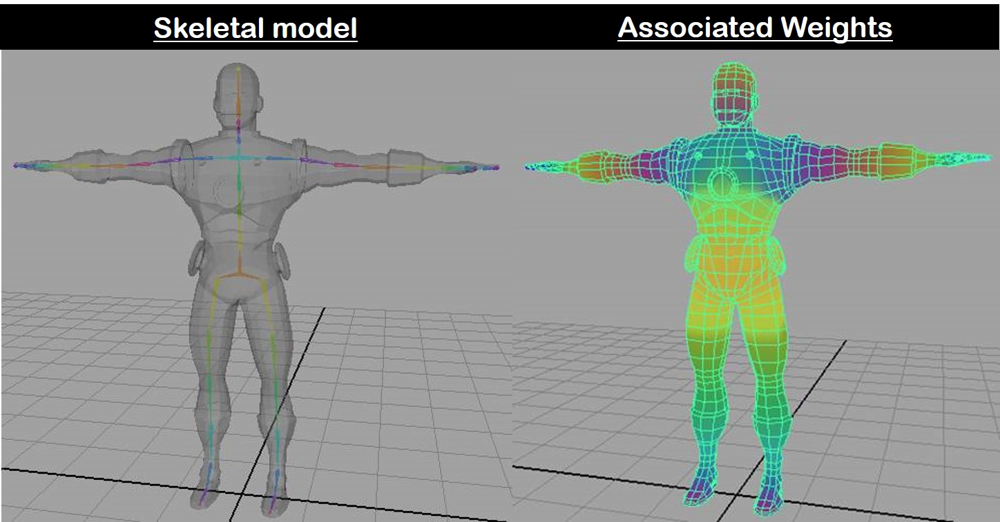

<section id="themes">
	<h2>Themes</h2>
		<p>
			Set your presentation theme: <br>
			<!-- Hacks to swap themes after the page has loaded. Not flexible and only intended for the reveal.js demo deck. -->
                        <a href="#" onclick="document.getElementById('theme').setAttribute('href','css/theme/black.css'); return false;">Black (default)</a> -
			<a href="#" onclick="document.getElementById('theme').setAttribute('href','css/theme/white.css'); return false;">White</a> -
			<a href="#" onclick="document.getElementById('theme').setAttribute('href','css/theme/league.css'); return false;">League</a> -
			<a href="#" onclick="document.getElementById('theme').setAttribute('href','css/theme/sky.css'); return false;">Sky</a> -
			<a href="#" onclick="document.getElementById('theme').setAttribute('href','css/theme/beige.css'); return false;">Beige</a> -
			<a href="#" onclick="document.getElementById('theme').setAttribute('href','css/theme/simple.css'); return false;">Simple</a> <br>
			<a href="#" onclick="document.getElementById('theme').setAttribute('href','css/theme/serif.css'); return false;">Serif</a> -
			<a href="#" onclick="document.getElementById('theme').setAttribute('href','css/theme/blood.css'); return false;">Blood</a> -
			<a href="#" onclick="document.getElementById('theme').setAttribute('href','css/theme/night.css'); return false;">Night</a> -
			<a href="#" onclick="document.getElementById('theme').setAttribute('href','css/theme/moon.css'); return false;">Moon</a> -
			<a href="#" onclick="document.getElementById('theme').setAttribute('href','css/theme/solarized.css'); return false;">Solarized</a>
		</p>
</section>

H:

# Forward and Inverse Kinematics on Frames

Sebastian Chaparro

H:

# Index

 1. Skeletal Animation<!-- .element: class="fragment" data-fragment-index="1"-->
 2. Forward Kinematics<!-- .element: class="fragment" data-fragment-index="2"-->
 3. Inverse Kinematics <!-- .element: class="fragment" data-fragment-index="3"-->
 4. IK Heuristic Methods <!-- .element: class="fragment" data-fragment-index="4"-->
 5. Using constraints <!-- .element: class="fragment" data-fragment-index="5"-->
 6. Adding IK on Frames <!-- .element: class="fragment" data-fragment-index="6"-->

H:

## Skeletal animation 


 * How to make a living Figure in 2D or 3D? <!-- .element: class="fragment" data-fragment-index="1"-->
 
 * A rigorous simulation should consider Bones, Muscles, Joints, Tendons, Ligaments and Cartilages. <!-- .element: class="fragment" data-fragment-index="2"-->

 * Here we focus on an abstraction of the Skeleton: A set of rigid multibody system called Bones (or links) attached by Joints. <!-- .element: class="fragment" data-fragment-index="3"-->

V:

## Skeleton

* Is usually represented as a Hierarchical Structure <!-- .element: class="fragment" data-fragment-index="1"-->

* Joints are parametrized by Degrees of Fredom (DOF) <!-- .element: class="fragment" data-fragment-index="2"-->

* An end effector $\mathbf{s}$ is a point of interest that depends on joint configurations: $ \mathbf{s} = f(\mathbf{ \theta }) $ <!-- .element: class="fragment" data-fragment-index="3"-->

<figure class="fragment" data-fragment-index="4">
    
</figure>

V:

## Skinning

* Skeleton model is used to define or modify Joint movements (e.g. [Keyframe animation](https://www.utdallas.edu/atec/midori/Handouts/keyframing.htm), [Procedural animation](https://www.alanzucconi.com/2017/04/17/procedural-animations/), [MoCap data](https://en.wikipedia.org/wiki/Motion_capture)).  
<!-- .element: class="fragment" data-fragment-index="1"-->

* Once motion is stablished, it is required to bind the Skeleton with a given 3D mesh.  <!-- .element: class="fragment" data-fragment-index="2"-->

* To do so it is defined an influence that every joint has to each vertex of the model. Then, the vertex is moved accordingly. 
<!-- .element: class="fragment" data-fragment-index="3"-->

* Check this short example [video](https://youtu.be/YXDzMZaAo0U). 
<!-- .element: class="fragment" data-fragment-index="4"-->

<figure class="fragment" data-fragment-index="5">
    
    <figcaption style="text-align: center;">[Image source](http://www.csit.parkland.edu/~dbock/Class/csc189/Lecture/CharacterBinding.html)</figcaption>
</figure>

H:

## Forward Kinematics (FK)
<section>
  <div style="text-align: justify-all; float: left; width: 50%">
  <br>
  <br>
    <ul style="text-align: justify-all; font-size: 1em !important;">
      <li class="fragment" data-fragment-index="1"> Given the joint configurations $ \mathbf{ \theta }$ find the End effector Position $ \mathbf{s} = f(\mathbf{ \theta })$ </li>
      <br>
      <li class="fragment" data-fragment-index="2"> Direct joint manipulation </li>
      <br>
      <li class="fragment" data-fragment-index="3"> Exhaustive </li>
      <br>
      <li class="fragment" data-fragment-index="4"> Not Redundant </li>
      <br>
    </ul>
  </div>
  <div style="text-align: justify-all; float : left; width : 50%" class=embed-container >
    <br>
    <iframe width="100%" height="500px" src="videos/FK.webm"></iframe>
  </div>
</section>

H:

## Inverse Kinematics (IK)

<section>
  <div style="text-align: justify-all; float: left; width: 50%">
  <br>
  <br>
    <ul style="text-align: justify-all; font-size: 1em !important;">
      <li class="fragment" data-fragment-index="1"> Given the state of the Final effector $ \mathbf{s} $ find joint configurations: $\mathbf{ \theta } = f^{-1}( \mathbf{ s}) $ </li>
      <br>
      <li class="fragment" data-fragment-index="2"> Indirect joint manipulation based on Goal Reaching </li>
      <br>
      <li class="fragment" data-fragment-index="3"> Root joint is Fixed </li>
      <br>
      <li class="fragment" data-fragment-index="4"> Not Exhaustive </li>
      <br>
      <li class="fragment" data-fragment-index="5"> Redundant </li>
      <br>
    </ul>
    <!-- more Elements -->
  </div>
  <div style="text-align: justify-all; float : left; width : 50%" class=embed-container >
    <br>
    <br>
    <iframe width="100%" height="500px" src="videos/IK.webm"></iframe>
  </div>
</section>

V:

## Requirements

IK on interactive applications must be:
* R1 Efficient: Take as little time as possible 

* R2 Accurate: Reach the goal position / orientation

* R3 Scalable: Work with Big amounts of DOF

* R4 Robust: Reach the goal when managing constraints 

* R5 Able to Generate natural poses

* R6 Generic: Deal with arbitrary Figures

V:
## IK Methods
| Kind      | R1 | R2 | R3 | R4 | R5 | R6 |
|-----------|-----------|----------|----------|-------------|---------|---------|
| Analitycal|     X     |     X    |    -     |      X      |    X    |    -    |
| Numerical |     -     |     X    |    X     |      X      |    -    |    X    |
| ** Numerical Heuristic (FABRIK) ** |     X     |     X    |    X     |      -      |    X    |    X    |

H:
# IK Heuristic Methods

V: 

## Cyclic Coordinate Descent (CCD)
Proposed by [Wang and Chen on 1991](http://web.cse.ohio-state.edu/~parent.1/classes/788/Sp06/ReferenceMaterial/IK/WC91.pdf)
<section>
  <div style="text-align: justify-all; float: left; width: 50%">
  <br>
    <ul style="text-align: justify-all; font-size: 1em !important;">
      <li class="fragment"> Works only on Kinematic chains. </li>
  	  </br>
      <li class="fragment"> Let $ \mathbf{v\_{it}} $ the vector formed by the $ith$ joint and the target position (Red one). </li>
  	  </br>
      <li class="fragment"> Let $ \mathbf{v\_{ie}} $ the vector formed by the $ith$ joint and the end effector position (Yellow one). </li>
  	  </br>
      <li class="fragment"> Modify each Joint configuration per iteration to reduce the error: </li>  
  	  </br>
  	  <div class="fragment">
      $$ cos(\theta \_{i}) = \frac{ \mathbf{v\_{ it }} } { \left| \mathbf{v \_{ it }} \right| } \frac{ \mathbf{v \_{ie}} }{ \left| \mathbf{v\_ {ie}} \right| } , \mathbf{r} = \mathbf{v\_{ it }} \times \mathbf{v\_{ ie }}$$ 
	  </div>
    </ul>
  </div>
  <div style="text-align: right; float = right; width = 50%; height = 100%" class=embed-container >
    <br>
    <iframe class="fragment" width="50%" height="500px" src="https://www.youtube.com/embed/MvuO9ZHGr6k"></iframe>
    <!-- more Elements -->
  </div>
</section>


V: 

## Forward and Backward Reaching Inverse Kinematics (FABRIK)
Proposed by [Andreas Aristidou on 2009](http://www.andreasaristidou.com/publications/papers/FABRIK.pdf)
<section>
  <div style="text-align: justify-all;  width: 100%"/>
  <br>
    <ul style="text-align: justify-all; font-size: 1em !important;">
      <li> Works on Positions Space. </li> 
  	  </br>
      <li> "Minimize error by adjusting each joint angle one at a time". </li>
      </br>
      <li> Move the structure while  keeping distances between Joints (bones are rigid) via finding a point on a line.  </li>
      </br>
      </br> 
      <div>Consider $ \mathbf{p}\_i$ the position of the $ ith $ joint in a chain, with $ i \in \\{ 1,2,...,n \\}$, $\mathbf{p}\_1$ the root of the chain, $\mathbf{p}\_n$ the end effector and $\mathbf{t}$ the target position.
      Let $ d\_i $ the distance between two consecutive joints:  $ d\_i = \left| \mathbf{p}\_i - \mathbf{p}\_{i+1} \right| $.
      </div>
    </ul>
</section>

V:
## FABRIK - FULL ITERATION

<div style="text-align: justify-all; float: left; width: 33%">
<figure>
    
</figure>
</div>
<div style="text-align: justify-all; float: left; width: 33%">
<figure>
    
    <figcaption>[Click for more info](http://www.andreasaristidou.com/publications/papers/FABRIK.pdf) </figcaption>
</figure>
</div>
<div style="text-align: justify-all; float: left; width: 33%">
<figure>
    
</figure>
</div>

V:
## FABRIK - PERFORMANCE
<div style="text-align: center; height = 100%" class=embed-container>
	<iframe width="80%" height="500px" src="https://www.youtube.com/embed/tN6RQ4yrNPU"></iframe>
</div>


H:

## Using constraints

<section style="text-align: left;">
  <div style="float: left; width: 50%" >
  <br>
  <br>
  <p style="text-align: left; font-size: 0.9em !important;">
  Limiting locally the joint movement by enclosing its related segment on a volume.
  </p>
  <ul style=" padding-left:40px; text-align: left; font-size: 0.7em !important;">
    <li>[Fast and Easy Reach-Cone Joint Limits](https://pdfs.semanticscholar.org/d535/e562effd08694821ea6a8a5769fe10ffb5b6.pdf)</li>
    <li>[A joint-constraint model using signed distance fields](https://link.springer.com/article/10.1007/s11044-011-9296-1)</li>
  </ul>
  <p style="text-align: left; font-size: 0.9em !important;">
  Using physical attributes.
  </p>
  <ul style=" padding-left:40px; text-align: left; font-size: 0.7em !important;">
    <li> [An Efficient Energy Transfer Inverse Kinematics Solution](https://pdfs.semanticscholar.org/aac6/cbd168f0e01911edbe564f59d7c1a00b7535.pdf)</li>
  </ul>
  <p style="text-align: left; font-size: 0.9em !important;">
  Locking a joint position or orientation.
  </p>
  <ul style=" padding-left:40px; text-align: left; font-size: 0.7em !important;">
    <li> [Nailing and pinning: Adding constraints to inverse kinematics](https://otik.uk.zcu.cz/bitstream/11025/11239/1/Greeff.pdf)</li>
  </ul>
  </div>
  <div style="text-align: middle; float = right; width = 50%; height = 100%">
    <div style="text-align: middle; float: right;">
      <br>
      <br>
      <figure>
          
      </figure>
      <figure>
          
      </figure>
      <!-- more Elements -->
    </div>
  </div>

</section>

H:

# Adding IK on Frames (On development)

H:

## Setting the Skeleton model

* We will consider a Skeleton as a Branch of the Graph Scene:

	> " The _scene_ is a high-level [Processing](https://processing.org/) scene-graph handler "

* The model is built by defining the initial configuration (position and orientation) of each Joint:

	> " A _frame_ is a 2D/3D coordinate system "

* Forward Kinematics is solved by transformation methods on _frame_ class.

V:

## Building explicitly the Skeleton model

Skeleton model could be defined explicitly as the following example suggest:

```java
//Building a Y-Shape Structure on XY-Plane
 World
  ^
  |\
  1 eye
  ^
  |
  2
  |\
  3 4

// creates a hierarchy of 'attached-frames'
float offset;
...
Frame f1 = new Frame(scene);
Frame f2 = new Frame(f1);
Frame f3 = new Frame(f2);
Frame f4 = new Frame(f2);
// set initial configuration
f2.translate(0,offset,0);
f3.translate(-offset,offset,0);
f4.translate(offset,offset,0);
```

V: 

## Getting Skeleton model from Data

There are different kind of files as [Collada](https://www.khronos.org/collada/) or [BVH](https://research.cs.wisc.edu/graphics/Courses/cs-838-1999/Jeff/BVH.html) to "transport 3D assets between applications",  in particular Skeleton model.

```java
//Reading a Structure from BVH File
BVHParser parser;
public void setup(){
	...
    parser = new BVHParser(sketchPath() + path, scene, null);
    Frame root = parser.root();
    ...
}

public void draw() {
	...
    parser.nextPose(); 
	...
}

```

```java
//Reading a Structure (Skeleton + Mesh) from Collada File
AnimatedModel model;
SkinningAnimationModel skinning;

public void setup(){
	...
    model = ColladaLoader.loadColladaModel(sketchPath() + path, dae, tex, scene);
    skinning = new SkinningAnimationModel(model);
    ...
}

public void draw() {
	...
	//Binding Mesh and Skeleton
    skinning.updateParams();
    shader(skinning.shader);
    shape(model.getModel());
    resetShader();
	...
}

```

V: 


## Getting Skeleton model from Data
<br>
<br>
<section>
  <div style="text-align: justify-all; float: left; width: 50%" class=embed-container >
  	BVH Demo
    <iframe width="100%" height="500px" src="videos/bvh_example.webm"></iframe>
  </div>
  <div style="text-align: justify-all; float : left; width : 50%" class=embed-container >
  	Collada Demo
    <iframe width="100%" height="500px" src="videos/dae_example.webm"></iframe>
  </div>
</section>


V:

## Setting the Skeleton model interactively

Use interaction methods to allow the user to define Skeleton model easyly.


<div style="text-align: justify-all;" class=embed-container >
	<iframe width="60%" height="500px" src="videos/build_demo.webm"></iframe>
</div>


**Challenges**
* Deal with depth information.

* Deal with joint overlapping.

* Allow to use non conventional HID.

V:

## Using constraints

As discussed previously IK behavior depends greatly on imposed restrictions.

<div style="text-align: justify-all;" class=embed-container >
	<iframe width="60%" height="500px" src="videos/constraints_demo.webm"></iframe>
</div>

V:

## Using constraints

* It is proposed the use of Hinge and [Cones](https://www.semanticscholar.org/paper/Extending-FABRIK-with-model-constraints-Aristidou-Chrysanthou/2930b87488207274c377dcd327b5e996a18f299b) constraints to limit the movement of 1-DOF and 3-DOF rotational Joints respectively. In both cases is needed orientational information of the Joints.

* IK constraints are added as common Frame constraints:

```java
public void addConeConstraint(Frame frame){
    BallAndSocket constraint = new BallAndSocket(downAngle, upAngle, leftAngle, rightAngle);
    Vector twist = frame.children().get(0).translation().get(); //Cone Axis
    Vector up = Vector.orthogonalVector(twist); //Up direction
    constraint.setRestRotation(frame.rotation(), up, twist);
    frame.setConstraint(constraint);
}
```

**Challenges**
* Deal with twist information.


H:

## Adding IK Behavior to a Skeleton structure

* It is desired to allow easy implementation and comparison of different kind of iterative Solvers (e.g CCD, FABRIK, SDLS, ...).

* Each solver must extends the Solver class. The behavior of a solver is determined by the following algorithm:

```java
  public boolean solve() {
    //If either Targets or Structure change
    if (_changed() || change_temp) {
      _reset();
    }

    if (iterations >= maxIter) {
      return true;
    }


    frameCounter += timesPerFrame;

    while (Math.floor(frameCounter) > 0) {
      //Returns a boolean that indicates if a termination condition has been accomplished
      if (_iterate()) { //Perform a solver step
        iterations = maxIter;
        break;
      } else iterations += 1;
      frameCounter -= 1;
    }
    //update structure
    _update();
    return false;
  }
```

V:

## Adding IK Behavior to a Skeleton structure

* When using a Solver there are some parameters that must be set:

```java
  //Default params
  Solver solver = ...;
  solver.error = 0.01f;
  solver.maxIter = 200;
  solver.minDistance = 0.1f;
  solver.timesPerFrame = 5.f;
```


V:

## Adding IK Behavior to a Scene branch

* Default solver in Frames is TreeSolver (Based on FABRIK to structures with Multiple End Effectors) 
* It is possible to add IK Behavior to a whole scene Branch.
* It is possible to add a target to any of this Branch Leaves.

```java
  //Setting Skeleton 
  Frame root = new Frame(scene);
  Frame[] endEffector, target; 
  ...
  //Adding IK behavior
  solver = scene.registerTreeSolver(root);
  //Add Targets
  for(int i = 0; i < endEffector.length; i++){
    scene.addIKTarget(endEffector[i], target[i]);
  }
```

V:

## Visual Benchmarking
<br>
<br>
<div style="text-align: justify-all; float: left; height: 70%; width: 100%" class=embed-container >
  <iframe width="100%" height="500px" src="videos/benchmark.webm"></iframe>
</div>


H:

# DEMOS

V:

## Building & Interacting

<br>
<br>
<section>
  <div style="text-align: justify-all; float: left; width: 50%" class=embed-container >
    Saying HI!
    <iframe width="100%" height="500px" src="videos/demo_2.webm"></iframe>
  </div>
  <div style="text-align: justify-all; float : left; width : 50%" class=embed-container >
    Multiple end Effectors
    <iframe width="100%" height="500px" src="videos/demo_skeleton.webm"></iframe>
  </div>
</section>


V:

## Procedural Animation

Fish - Flock

<br>
<br>
<section>
  <div style="text-align: justify-all; float: left; width: 50%" class=embed-container >
  	Fish Demo
    <iframe width="100%" height="500px" src="videos/fish_demo.webm"></iframe>
  </div>
  <div style="text-align: justify-all; float : left; width : 50%" class=embed-container >
  	Flock Demo
    <iframe width="100%" height="500px" src="videos/flock_demo.webm"></iframe>
  </div>
</section>

V:

## Procedural Animation

Multilegged gait simulation

<div style="text-align: justify-all;" class=embed-container >
	<iframe width="60%" height="500px" src="videos/procedural_demo.webm"></iframe>
</div>


H:

## References

* [Introduction to IK](https://www.math.ucsd.edu/~sbuss/ResearchWeb/ikmethods/index.html)

* [Inverse Kinematics Techniques in Computer Graphics: A Survey](http://www.andreasaristidou.com/InverseKinematics.html)

* [Forward and Backward Reaching Inverse Kinematics (FABRIK)](http://www.andreasaristidou.com/publications.html)

* [Cyclic Coordinate Descent (CCD)](https://sites.google.com/site/auraliusproject/ccd-algorithm)
