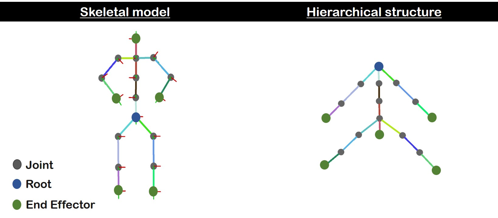
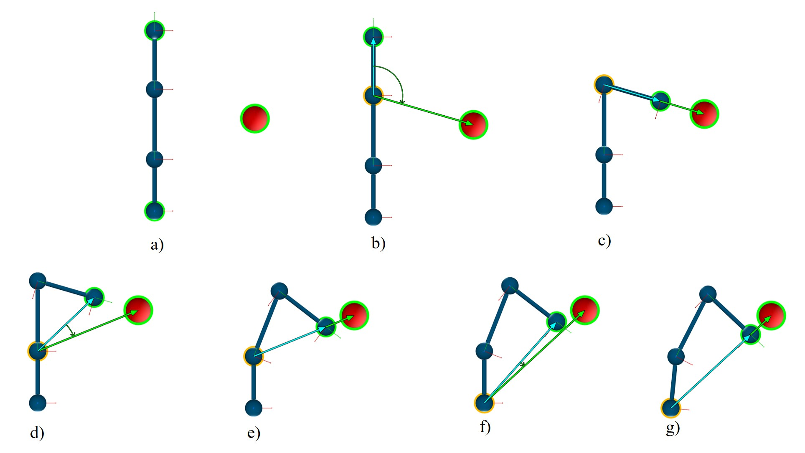
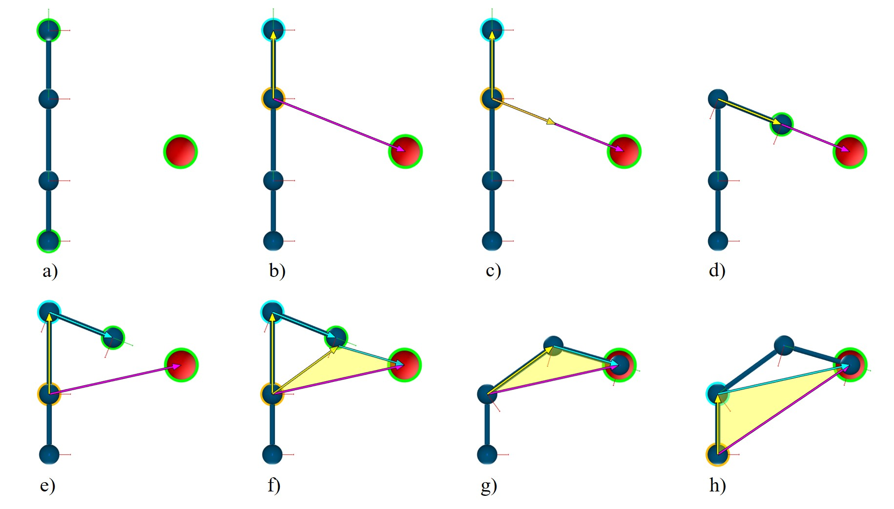
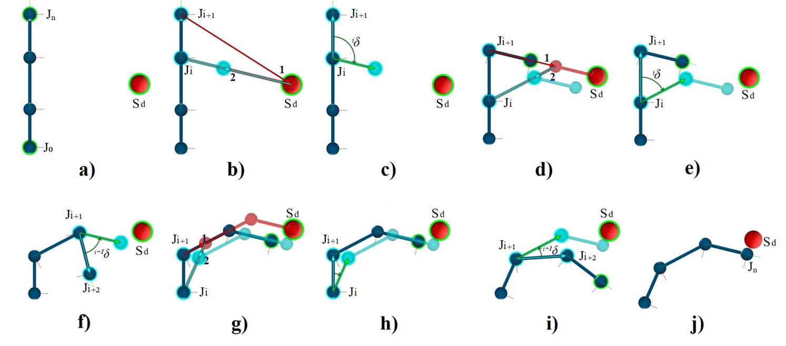
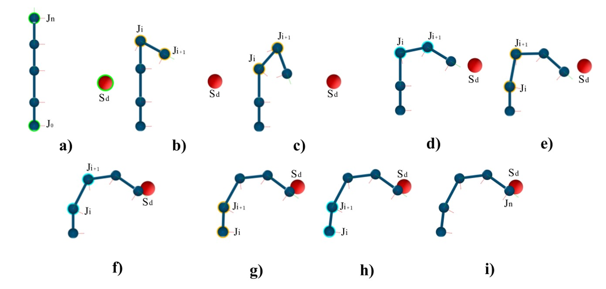
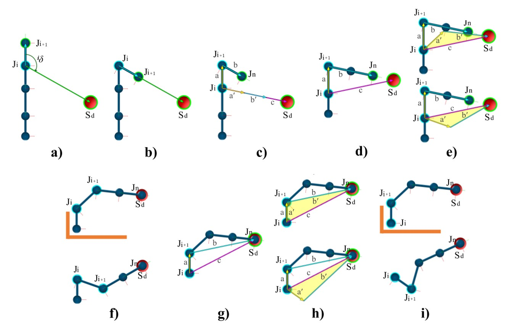

<section id="themes">
	<h2>Themes</h2>
		

			Set your presentation theme:  
			<!-- Hacks to swap themes after the page has loaded. Not flexible and only intended for the reveal.js demo deck. -->
                        <a href="#" onclick="document.getElementById('theme').setAttribute('href','css/theme/black.css'); return false;">Black (default)</a> -
			<a href="#" onclick="document.getElementById('theme').setAttribute('href','css/theme/white.css'); return false;">White</a> -
			<a href="#" onclick="document.getElementById('theme').setAttribute('href','css/theme/league.css'); return false;">League</a> -
			<a href="#" onclick="document.getElementById('theme').setAttribute('href','css/theme/sky.css'); return false;">Sky</a> -
			<a href="#" onclick="document.getElementById('theme').setAttribute('href','css/theme/beige.css'); return false;">Beige</a> -
			<a href="#" onclick="document.getElementById('theme').setAttribute('href','css/theme/simple.css'); return false;">Simple</a>  
			<a href="#" onclick="document.getElementById('theme').setAttribute('href','css/theme/serif.css'); return false;">Serif</a> -
			<a href="#" onclick="document.getElementById('theme').setAttribute('href','css/theme/blood.css'); return false;">Blood</a> -
			<a href="#" onclick="document.getElementById('theme').setAttribute('href','css/theme/night.css'); return false;">Night</a> -
			<a href="#" onclick="document.getElementById('theme').setAttribute('href','css/theme/moon.css'); return false;">Moon</a> -
			<a href="#" onclick="document.getElementById('theme').setAttribute('href','css/theme/solarized.css'); return false;">Solarized</a>
		

</section>

H:

# Kinematics on nub

Sebastian Chaparro

H:

# Index

 1. Introduction<!-- .element: class="fragment" data-fragment-index="1"-->
 2. Forward Kinematics<!-- .element: class="fragment" data-fragment-index="2"-->
 3. Inverse Kinematics <!-- .element: class="fragment" data-fragment-index="3"-->
 4. IK Heuristic Methods <!-- .element: class="fragment" data-fragment-index="4"-->
 5. Using constraints <!-- .element: class="fragment" data-fragment-index="5"-->
 6. Demos <!-- .element: class="fragment" data-fragment-index="6"-->

H:

## Introduction

 * How to bring to life animated objects? <!-- .element: class="fragment" data-fragment-index="1"-->

 * One approach is [skeletal animation](https://en.wikipedia.org/wiki/Skeletal_animation) where the object to animate is represented by a skeleton and a skin.
 <!-- .element: class="fragment" data-fragment-index="2"-->  

V:

## Skeleton

* Set of rigid multibody system called bones (or links) attached by joints. A skeleton usually is represented as a hierarchical structure. <!-- .element: class="fragment" data-fragment-index="1"--> 
* Joints are parametrized by Degrees of Fredom (DOF). <!-- .element: class="fragment" data-fragment-index="2"--> 

* An end effector $\mathbf{s}$ is a point of interest that depends on joint configurations: $ \mathbf{s} = f(\mathbf{ \theta }) $ <!-- .element: class="fragment" data-fragment-index="3"-->
* <!-- .element: class="fragment" data-fragment-index="4"--> Skeleton is used to define or modify movements (e.g. [Keyframe animation](https://www.utdallas.edu/atec/midori/Handouts/keyframing.htm), [Procedural animation](https://www.alanzucconi.com/2017/04/17/procedural-animations/), [MoCap data](https://en.wikipedia.org/wiki/Motion_capture)). 

V:

<figure class="fragment" data-fragment-index="4">
    
</figure>

V:

## Skin

* Once motion is set, it is required to bind the skeleton with a surface (2D or 3D mesh).  
<!-- .element: class="fragment" data-fragment-index="1"-->

* Skeleton motion must deform the mesh smoothly (e.g when we bend the elbow, the skin around the bones stretches and shrinks).
<!-- .element: class="fragment" data-fragment-index="2"-->

* To do so, given a mesh vertex it is defined an influence weight per skeleton joint. The vertex is deformed according to joint transformations. 
<!-- .element: class="fragment" data-fragment-index="3"-->

* Check this short example [video](https://youtu.be/YXDzMZaAo0U). 
<!-- .element: class="fragment" data-fragment-index="4"-->

V:

## Skinning
<iframe width="100%" height="500px" data-src="videos/Skinning.webm"></iframe>

H:

## Forward Kinematics (FK)
<section>
  

   
   
    <ul style="text-align: justify-all; font-size: 1em !important;">
      <li class="fragment" data-fragment-index="1"> Given the joint configurations $ \mathbf{ \theta }$ find the End effector Position $ \mathbf{s} = f(\mathbf{ \theta })$ </li>
       
      <li class="fragment" data-fragment-index="2"> Direct joint manipulation </li>
       
      <li class="fragment" data-fragment-index="3"> Must define each joint position/orientation. </li>
       
      <li class="fragment" data-fragment-index="4"> Not Redundant </li>
       
    </ul>
  

  

     
     
    <iframe class="fragment" data-fragment-index="5" width="100%" height="500px" data-src="videos/FK.webm"></iframe>
  

</section>

H:

## Inverse Kinematics (IK)
  

    <ul style="text-align: justify-all; font-size: 1em !important;">
      <li class="fragment" data-fragment-index="1"> Given the state of the Final effector $ \mathbf{s} $ find joint configurations: $\mathbf{ \theta } = f^{-1}( \mathbf{ s}) $ </li>
       
      <li class="fragment" data-fragment-index="2"> Indirect joint manipulation based on Goal Reaching </li>
       
      <li class="fragment" data-fragment-index="3"> Root joint is Fixed </li>
       
      <li class="fragment" data-fragment-index="4"> Must define only a target position/orientation. </li>
       
      <li class="fragment" data-fragment-index="5"> Redundant </li>
       
    </ul>
    <!-- more Elements -->
  

  

     
    <iframe class="fragment" data-fragment-index="6" width="100%" height="500px" data-src="videos/IK.webm"></iframe>
  

V:

## Requirements

IK methods on interactive applications must be:
* R1 Efficient: Take as little time as possible.
<!-- .element: class="fragment" data-fragment-index="1"-->
* R2 Accurate: Reach the target position / orientation.
<!-- .element: class="fragment" data-fragment-index="2"-->
* R3 Scalable: Work with Big amounts of DOF. 
<!-- .element: class="fragment" data-fragment-index="3"-->
* R4 Robust: Reach the goal when managing constraints.
<!-- .element: class="fragment" data-fragment-index="4"-->
* R5 Visual smooth: Generate visual appealing postures.
<!-- .element: class="fragment" data-fragment-index="5"-->
* R6 Generic: Deal with arbitrary Figures.
<!-- .element: class="fragment" data-fragment-index="6"-->
V:
## IK Methods

* Different methods to solve IK fall into four main categories: analytic, numerical, data-driving and hybrid methods <!-- .element: class="fragment" data-fragment-index="1"--> [IK Survey](http://andreasaristidou.com/publications/papers/IK_survey.pdf).
<!-- .element: class="fragment" data-fragment-index="1"-->
* IK heuristic methods are preferred in real time applications due to their generality and low
computational cost. 
<!-- .element: class="fragment" data-fragment-index="2"-->
* Most widely used heuristic algorithms are forward and backward reaching inverse kinematics <!-- .element: class="fragment" data-fragment-index="3"--> [FABRIK](http://andreasaristidou.com/publications/papers/FABRIK.pdf), <!-- .element: class="fragment" data-fragment-index="3"-->Cyclic Coordinate Descent [CCD](https://ieeexplore.ieee.org/document/86079) <!-- .element: class="fragment" data-fragment-index="3"-->and Triangulation [TIK](https://ir.canterbury.ac.nz/bitstream/handle/10092/743/12607089_ivcnz07.pdf;jsessionid=952204D48736D487ED320E8CF926B1BD?sequence=1).
<!-- .element: class="fragment" data-fragment-index="3"-->

H:
# Solving IK

V: 
## Our Approach
* Define IK heuristic steps that works in rotation-space based on CCD, TIK and FABRIK.
<!-- .element: class="fragment" data-fragment-index="1"-->
* Couple these heuristics to efficiently deal with highly constrained articulated bodies.
<!-- .element: class="fragment" data-fragment-index="2"-->
* Define a generic heuristic algorithm for IK (GHIK)  that applies iteratively IK heuristic steps.
<!-- .element: class="fragment" data-fragment-index="3"-->

V:
# IK Heuristic Steps

V:
## CCD Step

* Moves a joint $J_i$ assuming that the remaining ones keep Fixed.

<figure class="fragment" data-fragment-index="1">
  
  <figcaption>Full iteration of CCD steps</figcaption>
</figure>

V:
## TIK Step

* Moves a pair of consecutive joints `$J_i , J_{i+1}$` assuming that the remaining ones keep Fixed.

<figure class="fragment" data-fragment-index="1">
  
  <figcaption>Full iteration of TIK steps</figcaption>
</figure>

V:
## TRIK Step

* Translate and reach inverse kinematics (TRIK) is a FABRIK-inspired IK heuristic step that works on the rotation space.
* Intuition: Moves a pair of consecutive joints `$J_i , J_{i+1}$` to approach the target while keeping `$J_{i+1}$` orientation.

<figure class="fragment" data-fragment-index="1">
  
  <figcaption>Full iteration of TRIK steps</figcaption>
</figure>

V:
## FABRIK DEMO
* Intuition: Reach the target and fix the bone length.
<iframe width="100%" height="500px" data-src="videos/FABRIK_Solver_1.webm"></iframe>

V:
## B&FIK Step
* In some cases TIK and TRIK produce undesired solutions when joints are highly constrained. 
* A back and forth IK (B&FIK) heuristic step solves this issue applying a few number of CCD steps to refine a given set of candidate
solutions. 
* Candidate solutions may be obtained using CCD, TIK and TRIK.

<figure class="fragment" data-fragment-index="1">
  
  <figcaption>Full iteration of B&FIK-CCD steps</figcaption>
</figure>

V:

## ECTIK Step
* Extended CCD-Triangulation IK (ECTIK) heuristic step deals with constrained articulated bodies and deadlock issues.
* A small TIK modification is applied over `$J_{i+1}$` in order to generate at most two candidate solutions that are further refined by a B&FIK step. 

<figure class="fragment" data-fragment-index="1">
  
  <figcaption>Full iteration of ECTIK steps</figcaption>
</figure>

H:
## Using constraints
  

   
    <ul style="text-align: justify-all; font-size: 1em !important;">
      <li class="fragment" data-fragment-index="1"> When end effectors are manipulated we expect to obtain intuitive poses.</li>
       
      <li class="fragment" data-fragment-index="2"> There could exist many solutions (i.e many different poses) that satisfy the IK problem. </li>
       
      <li class="fragment" data-fragment-index="3"> Limiting the movement of the skeleton could enhance IK performance. </li>
    </ul>
  

  

     
    <iframe class="fragment" data-fragment-index="4" width="100%" height="500px" data-src="videos/multiple_solutions.webm"></iframe>
  

V:
## Using constraints
  

  

  Limiting the joint movement locally by enclosing its related segment on a volume.
  

  <ul style=" padding-left:40px; text-align: left; font-size: 0.7em !important;">
    <li class="fragment" data-fragment-index="1">[Fast and Easy Reach-Cone Joint Limits](https://pdfs.semanticscholar.org/d535/e562effd08694821ea6a8a5769fe10ffb5b6.pdf)</li>
    <li class="fragment" data-fragment-index="1">[A joint-constraint model using signed distance fields](https://link.springer.com/article/10.1007/s11044-011-9296-1)</li>
  </ul>
  

  Using physical attributes.
  

  <ul class="fragment" data-fragment-index="2" style=" padding-left:40px; text-align: left; font-size: 0.7em !important;">
    <li> [An Efficient Energy Transfer Inverse Kinematics Solution](https://pdfs.semanticscholar.org/aac6/cbd168f0e01911edbe564f59d7c1a00b7535.pdf)</li>
  </ul>
  

  Locking a joint position or orientation.
  

  <ul class="fragment" data-fragment-index="3" style=" padding-left:40px; text-align: left; font-size: 0.7em !important;">
    <li> [Nailing and pinning: Adding constraints to inverse kinematics](https://otik.uk.zcu.cz/bitstream/11025/11239/1/Greeff.pdf)</li>
  </ul>
  

  

    

      <figure class="fragment" data-fragment-index="1">
          
      </figure>
      <figure class="fragment" data-fragment-index="3">
          
      </figure>
      <!-- more Elements -->
    

  

V:
## Using local constraints - Example
  

   
    <ul style="text-align: justify-all; font-size: 1em !important;">
      <li class="fragment" data-fragment-index="1"> Assume that Node 0 rotate only around a fixed axis (1 DOF).</li>
       
      <li class="fragment" data-fragment-index="2"> Assume that Node 0 rotation is enclosed by a minimum and a maximum angle. </li>
       
      <li class="fragment" data-fragment-index="3"> With local constraints there's a unique solution when target is reachable. </li>
    </ul>
  

  

     
    <iframe class="fragment" data-fragment-index="5" width="100%" height="500px" data-src="videos/constraint_1.webm"></iframe>
  

V: 
## Hinge constraint
1-DOF rotational constraint. i.e the node will rotate only around a single direction. Furthermore, the rotation made by the constrained node is enclosed on a minimum and maximum angle.
<iframe width="100%" height="400px" data-src="videos/hinge_interactive.webm"></iframe>

V: 
## Ball and socket constraint
3-DOF rotational constraint (the node could rotate around any direction) that decomposes a rotation into two components called Swing (2-DOF) and Twist (1-DOF) rotations and limits each of them (see [FABRIK paper](http://www.andreasaristidou.com/publications/papers/FABRIK.pdf)).
<iframe width="100%" height="400px" data-src="videos/BallAndSocket.webm"></iframe>

H:

# DEMOS

V:
## Getting skeleton from Data
There are different kind of files as [Collada](https://www.khronos.org/collada/) or [BVH](https://research.cs.wisc.edu/graphics/Courses/cs-838-1999/Jeff/BVH.html) to "transport 3D assets between applications". Here we are interested on skeletal structure.

  BVH Demo
  <iframe width="100%" height="400px" data-src="videos/bvh_example.webm"></iframe>

  Collada Demo
  <iframe width="100%" height="400px" data-src="videos/dae_example.webm"></iframe>

V:
## Building & Interacting
Allow the user to define and interact with the skeletal structure easyly.

  Saying HI!
  <iframe width="100%" height="500px" data-src="videos/demo_2.webm"></iframe>

  Multiple end Effectors
  <iframe width="100%" height="500px" data-src="videos/demo_skeleton.webm"></iframe>

V:
## Skinning
Allow the user to define a skeleton and bind it to a mesh.
<iframe width="100%" height="500px" data-src="videos/builder_demo_high_speed.webm"></iframe>

V:
## Procedural Animation

  Fish Demo
  <iframe width="100%" height="500px" data-src="videos/fish_demo.webm"></iframe>

  Flock Demo
  <iframe width="100%" height="500px" data-src="videos/flock_demo.webm"></iframe>

V:
## Procedural Animation
Eagle Demo
<iframe width="100%" height="500px" data-src="videos/eagle_demo.webm"></iframe>

V:
## Procedural Animation
Multilegged gait simulation

	<iframe width="100%" height="500px" data-src="videos/procedural_demo.webm"></iframe>

H:

## References

* [Introduction to IK](https://www.math.ucsd.edu/~sbuss/ResearchWeb/ikmethods/index.html)

* [Inverse Kinematics Techniques in Computer Graphics: A Survey](http://www.andreasaristidou.com/InverseKinematics.html)

* [Forward and Backward Reaching Inverse Kinematics (FABRIK)](http://www.andreasaristidou.com/publications.html)

* [Cyclic Coordinate Descent (CCD)](https://sites.google.com/site/auraliusproject/ccd-algorithm)
